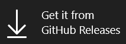

<p align="center">
  
</p>

<p align="center">
  <a href="https://www.microsoft.com/store/productId/9PNXW61T4T0V" target="_blank">
    </a>
  <a href="https://bluebird-developers.github.io/releases/bluebird.appinstaller" target="_blank">
    </a>
</p>

## Features:
- Responsive UI and quick startup time
- Integrates nicely with other native Windows apps 
- Split tabs
- Reading mode
- Force dark mode for all websites
- Translate websites
- Password lock
- Generate QRCode for website
- Export page to pdf (version 5.1 and newer)
- New tab background images (you can disable them)

Check the app out to see them in action! 

## Building from source

### 1. Prerequisites
- Visual Studio 2022, version 17.X (version 17.12.X recommendend)
- Windows 11 SDK (10.0.26100.0)
- Windows Application Workload + Universal Windows Platform Tools

### 2. Clone the repository
```batch
git clone https://github.com/bluebird-developers/browser.git
```

### 3. Build the app
In the newly cloned folder, navigate into the src folder and open Bluebird.sln (or Bluebird.slnx if you prefer that)
On the top, select your configuration and platform and click on the play icon.
Now VS should start building the app and will start it shortly.

## License
GPL v3.0
