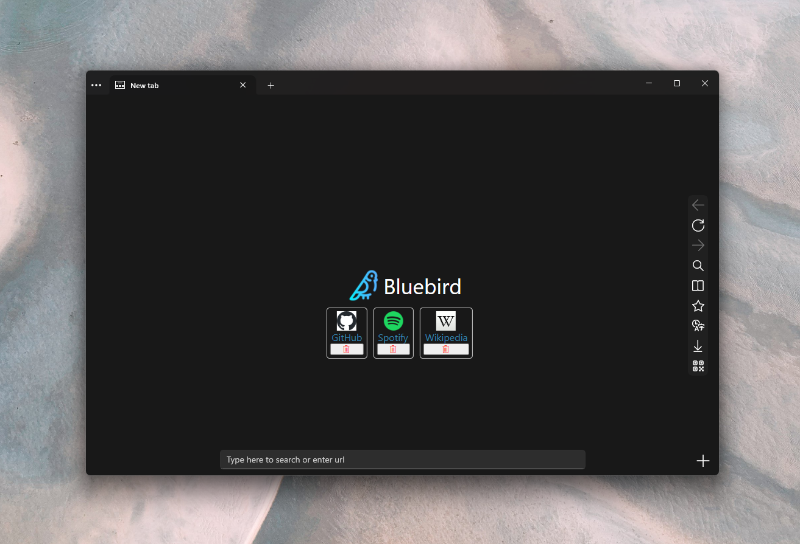

<div align="center">
  
  <p style="font-size:25px;">Bluebird</p>
</div>

## Download
<div style="display:flex;">
  <a href="https://www.microsoft.com/store/productId/9PNXW61T4T0V" target="_blank"></a>

  <a href="https://bluebird-developers.github.io/releases/bluebird.appinstaller" target="_blank"></a>
</div>




## Features:
- Browse the web
- Responsive UI and quick startup time
- Reading mode
- Force dark mode for all websites
- Quick shortcuts on new tab page
- Translate websites
- Password lock
- Generate QRCode for website
- Export page to pdf (version 5.1 and newer)

### Upcoming:
- Timeline

Check the app out to see them in action! 

## Building from source

### 1. Prerequisites
- Visual Studio 2022
- Windows 11 SDK (10.0.22621.0)
- UWP Workload

### 2. Clone the repository
```batch
git clone https://github.com/bluebird-developers/browser.git
```

### 3. Build the app
In the newly cloned folder, navigate into the src folder and open Bluebird.slnx
On the top, select your configuration and platform and click on the play icon.
Now VS should start building the app and will start it shortly.


## License
GPL v3.0
